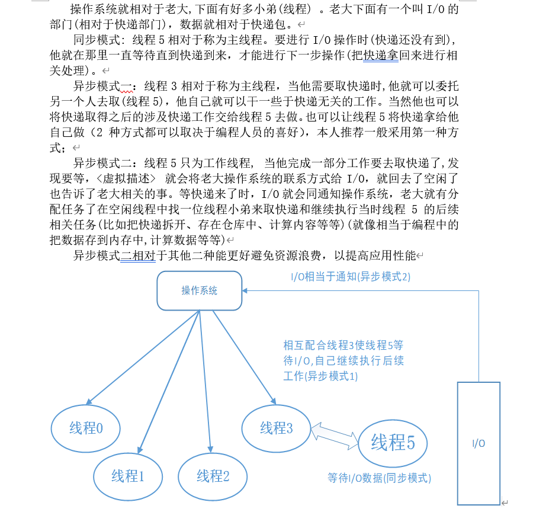

# WEBTest

一个学习和练习的项目

## 1. 练习WebSocket及异步IO编程自己的理解

### 1.1 WebSocket概念  &emsp;&emsp;&emsp;&emsp;注:20/2/11日更新

1. WebSocket 是 HTML5 开始提供的一种在单个 TCP 连接上进行全双工通讯的协议。WebSocket 使得客户端和服务器之间的数据交换变得更加简单，允许服务端主动向客户端推送数据。在 WebSocket API 中，浏览器和服务器只需要完成一次握手，两者之间就直接可以创建持久性的连接，并进行双向数据传输。

2. 好处:提高性能，不需要类似于心跳模式方式循环请求Http请求

3. 在dotnetCore 中的用法具体可以查看[微软官方文档](https://docs.microsoft.com/zh-cn/aspnet/core/fundamentals/websockets?view=aspnetcore-3.1)
4. 以为是本文的例子:

            #region UseWebSocketsOptionsAO
            var webSocketOptions = new WebSocketOptions()

            {
                KeepAliveInterval = TimeSpan.FromSeconds(120),

                ReceiveBufferSize = 4 * 1024
            };
            app.UseWebSockets(webSocketOptions);

            #endregion UseWebSocketsOptionsAO

            app.Use(async (context, next) =>
            {
                if (context.Request.Path == "/ws")
                {
                    if (context.WebSockets.IsWebSocketRequest)
                    {
                        WebSocket webSocket = await context.WebSockets.AcceptWebSocketAsync();
                        //从DI容器中获取cache对象为进行手动依赖注入
                        var cache =app.ApplicationServices.GetService<IMemoryCache>();
                        //因为此控制器与MVC框架中不同所以手动注入(对MVC框架的控制器自己无法做到兼容)
                        var webSocketController = new Controllers.WebSocketController(cache);
                        //具体的执行方法
                        await webSocketController.Echo(context, webSocket);
                    }
                    else
                    {
                        context.Response.StatusCode = 400;
                    }
                }
                else
                {
                    await next();
                }
            });

        //具体的执行方法 异步方法
        public async Task Echo(HttpContext context, WebSocket webSocket)
        {
            var buffer = new byte[1024 * 4];
            var list = (IList<WebSocket>)_cache.Get("webSocketCache");
            list.Add(webSocket);
            //异步 IO等待接受消息 此代码底层会涉及IO操作 IO未接收到数据将会挂起等待
            //线程自动返回为空闲状态 既不会占用线程资源，注:也就是说此线程空闲后可以执行其他的任务。
            //当有数据时接收到时，操作系统会类似通知应用程序，应用程序将从线程池中分配线程任务继续执行后续操作
            //可在调试器堆栈信息看出此步叫做"异步恢复"
            WebSocketReceiveResult result = await webSocket.ReceiveAsync(new ArraySegment<byte>(buffer), CancellationToken.None);

            while (!result.CloseStatus.HasValue)
            {
                #region 群发消息 
                foreach (var ItemSocket in list)
                {
                    await ItemSocket.SendAsync(new ArraySegment<byte>(buffer, 0, result.Count), result.MessageType, result.EndOfMessage, CancellationToken.None);
                }
                #endregion
                //异步 IO等待接受消息
                result = await webSocket.ReceiveAsync(new ArraySegment<byte>(buffer), CancellationToken.None);
            }
            await webSocket.CloseAsync(result.CloseStatus.Value, result.CloseStatusDescription, CancellationToken.None);
            //关闭连接后 移除对象
            list.Remove(webSocket);
        }

### 1.2 异步编程之IO绑定

1. 推荐查阅微软文档了解异步的相关概念及相关原理;
[微软官方文档~异步编程模式](https://docs.microsoft.com/zh-cn/dotnet/csharp/async);
[微软官方文档~深入了解异步](https://docs.microsoft.com/zh-cn/dotnet/standard/async-in-depth);

2. 相关自己理解重要概念
   1. 任务(Task对象)是用于实现称之为并发 Promise 模型的构造。 简单地说，它们“承诺”，会在稍后完成工作。

   2. 在使用await和async关键字对的执行I/O操作的关键点在于没有线程专用于运行任务。尽管需要在一些上下文中执行工作（即，操作系统确实必须
   将数据传递到设备驱动程序并响应中断），但没有专用于等待数据从请求返回的线程。这让系统能处理更多的工作而不是等待某些 I/O 调用结束.

   3. 绑定CPU的async代码与绑定I/O的async代码有些许不同。由于工作在CPU上执行，无法解决线程专用于计算的问题。async和await的运用使得可以与后台线程交互并让异步方法调用方可响应。

   4. 总结:对于I/O绑定和CPU绑定的区别。因为线程是操作系统对CPU(硬件设备)逻辑资源上的一种抽象,所以导致他们异步模式存在差异性(仅对C#这种异步实现)。因为I/O涉及多种不同与CPU的硬件资源，所以线程在执行到最底层等待I/O响应时(等待数据)，操作系统将会释放此线程的等待将其归还给线程池中，而I/O将会挂起直到有数据时操作系统进行异步恢复，线程池重新分配线程进行后续工作。与之相反的异步实现是可以用于一个线程进行I/O的等待这样将会造成资源的浪费。而对于CPU绑定是无法解决线程专用于计算的问题。以下会通过图例进行模拟说明。

   